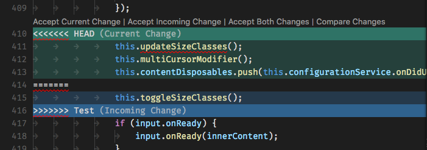

<div style="text-align: justify;">


# Guía definitiva de Git

### Instalar git
 
**Git** es un software de control de versiones, pensando en la eficiencia y la confiabilidad del mantenimiento de versiones de aplicaciones cuando éstas tienen un gran número de archivos de código fuente. Su propósito es llevar registro de los cambios en archivos de computadora y coordinar el trabajo que varias personas realizan sobre archivos compartidos.
 
El siguiente comando instalará **git** en Linux:
 
```bash
sudo apt install git
```

### Ayuda detallada sobre git
 
```sh
$ git--help
```
 
### Ayuda detallada sobre un comando concreto
 
```sh
$ git --help nombreComando
```
<div STYLE="page-break-after: always;"></div>
 
### Opciones de configuración

```sh
$ git config --list
```
A continuación se mostrarán comandos para ejecutar distintas opciones básicas de configuración de git.

#### Agregar nombre de usuario de forma global
 
```sh
$ git config --global user.name
```
 
#### Agregar email de usuario de forma global
 
```sh
$ git config --global user.email
```
 
#### Hacer que la interfaz use colores para resaltar distintos aspectos en el texto
 
```sh
$ git config --global color.ui true
```
 
#### Cambiar la ubicación del archivo .gitignore
 
```sh
$ git config --global core.excludesfile rutaAlArchivoIgnore
```

#### Agregar nombre de usuario de forma local
 
```sh
$ git config --local user.name
```
 
#### Agregar email de usuario de forma local
 
```sh
$ git config --local user.email
```


### Inicializar el repositorio
 
```sh
$ git init
```
<div STYLE="page-break-after: always;"></div>

### Visualizar estado del repositorio
El siguiente comando enumera los archivos que se han preparado, los que están sin preparar y los archivos sin seguimiento:
 
``` sh
$ git status
```
 
Para ver el estado del archivo en una sola línea ejecutamos el comando:
 
``` sh
$ git status -s
```
 
Para visualizar el estado del archivo y la rama el la que nos encontramos, ejecutamos:
 
``` sh
$ git status -s -b
```
 
o
 
``` sh
$ git status -sb
```


### Añadir al seguimiento
 
Esta opción nos permitirá actualizar archivos locales que estén sin seguimiento.
 
Añade todos los archivos de git que se encuentren sin seguimiento o que hayan sufrido modificaciones.
 
Este comando se puede utilizar en su forma simple con la opción -u o en su estilo completo utilizando --update.
 
``` sh
 $ git add -u
```
 
``` sh
 $ git add --update
```
 
<div STYLE="page-break-after: always;"></div>

### Quitar del seguimiento
 
Para quitar un archivo que se encuentra en el stage para que no se le realice el seguimiento podremos utilizar el siguiente comando.
 
``` sh
 $ git reset <nombreArchivo>
```
### Añadir commit
 
Para añadir el commit se usa el siguiente comando:
 
```sh
   git commit -m "Mensaje del commit"
```
 


### Modificar commit
 
Existe una forma de cambiar la confirmación más reciente. Esto le permite combinar los cambios en el nivel de ensayo con la confirmación anterior en lugar de crear una confirmación completamente nueva. Sin embargo, la corrección no solo cambia la confirmación más reciente, sino que la reemplaza por completo. El comando a utilizar es:
 
```sh
$ git commit --amend
```


### Renombrar commit
 
El comando anterior se utiliza también para modificar únicamente el mensaje del commit, sin alterar los archivos originalmente incluidos en el mismo:

```sh
$ git commit --amend
```
<div STYLE="page-break-after: always;"></div>
 
### Visualizar estado log
 
Después de haber hecho uno o varios commits, o si has clonado un repositorio que ya tenía un histórico de commits, probablemente el usuario quiera mirar atrás para ver los commits que se han llevado a cabo. Esto es posible con el comando:
 
```sh
git log
```
 
Para este comando existen diferentes opciones para su visualización. A continuación se exponen las opciones más comunes:
 
###### Logs en una sóla línea
 
Muestra el historial de commits reducidos a una sóla línea para una mejor visualización:
 
```sh
git log --oneline
```
 
###### Mostrar todos los commits
 
Si el usuario desea visualizar todos los commits hasta ese momento, la opción que debe usar en git log es:
 
```sh
git log --all
```
<div STYLE="page-break-after: always;"></div>
 
###### Diagrama de ramas
 
Si el repositorio tiene ramas (branchs) existe la opción de mostrar más información de las ramas existentes y sus uniones (merges) con la opción siguiente:
 
```sh
git log --graph
```
 
Dicho comando se puede combinar con --oneline:
 
```sh
git log --graph --oneline
```
 
Y con --decorate, para una mejor visualización:
 
```sh
git log --graph --oneline --decorate
```
 
###### Mostrar "n" commits
 
Si el usuario desea visualizar los "n" últimos commits puede añadir "-n" con el número de commits que desea visualizar (1, 2, 3, 4 ... etc). La opción quedaría de la siguiente forma:
 
```sh
git log -n
```
<div STYLE="page-break-after: always;"></div>

### Moverse en el tiempo
 
En Git existe una herramienta compleja y versátil para deshacer cambios, muy útil al igual que peligrosa, es por ello que hay que tener cuidado a la hora de usarla. Dicha herramienta moverá el puntero HEAD y el de referencia al momento que el usuario desee. Esto es posible con el comando:
 
```sh
git reset HEAD [HASH]
```
 
La invocación predeterminada de *git reset* tiene argumentos implícitos de *--mixed* y *HEAD*. Esto significa que ejecutar git reset es equivalente a ejecutar *git reset --mixed HEAD*. De esta forma, *HEAD* es la confirmación especificada. En vez de *HEAD*, se puede usar cualquier hash de confirmación SHA-1 de Git.
 
Para este comando existen diferentes opciones para su visualización. A continuación se exponen las opciones más comunes:
 
###### --hard
 
Esta es la opción más directa, PELIGROSA y que se usa más frecuentemente. Cuando se pasa *--hard*, los punteros de referencia del historial de confirmaciones se actualizan a la confirmación especificada. A continuación, el índice del entorno de ensayo y el directorio de trabajo se restablecen para reflejar la confirmación especificada. Todos los cambios pendientes anteriores del índice del entorno de ensayo y el directorio de trabajo se restablecen para reflejar el estado del árbol de confirmaciones. Esto significa que se perderá cualquier trabajo pendiente que estuviera colgado en el índice del entorno de ensayo y el directorio de trabajo. La opción quedaría de esta forma:
 
```sh
git reset --hard HEAD [HASH]
```
 
###### --mixed
 
Este es el modo de funcionamiento predeterminado. Se actualizan los punteros de referencia. El índice del entorno de ensayo se restablece al estado de la confirmación especificada. Todos los cambios que se hayan deshecho en el índice del entorno de ensayo se mueven al directorio de trabajo.
 
```sh
git reset --mixed HEAD [HASH]
```
 
###### --soft
 
Cuando se pasa el argumento --soft, se actualizan los punteros de referencia y el restablecimiento se detiene ahí. El índice del entorno de ensayo y el directorio de trabajo permanecen intactos.
 
```sh
git reset --soft HEAD [HASH]
```


### Deshacer cambios en un archivo
 
En Git existe una herramienta con la cual el usuario podrá volver a la anterior versión de HEAD (la del último commit). El comando sería:
 
 
```sh
git checkout -- NOMBRE_DEL_ARCHIVO
```

### Mover y cambiar el nombre del archivo indicado
 
```sh
$ git mv nombreArchivo nombreArchivoNuevo
```
 


### Borrar archivos
 
```sh
$ git rm
```
 
### Borrar el archivo indicado
 
```sh
$ git rm nombreArchivo
```
 
### Borrar el archivo indicado del index sin borrarlo del directorio de trabajo
 
```sh
$ git rm --cached nombreArchivo
```
 


### Crear archivo .gitignore
 
Cuando ejecutamos el comando "git add ." preparamos todos los archivos que hayan sido modificados. Pero muy a menudo hay archivos en el directorio de trabajo que no queremos que se añadan. Para evitar este problema y facilitar el trabajo, git permite crear un archivo donde escribir qué archivos se quieren ignorar.
El archivo debe llamase ".gitignore" (comenzando por punto) y ubicarse en el directorio raíz del proyecto.
En este archivo se deben incluir los nombres de archivos que se quieran ignorar.
Cada repositorio puede tener su propio .gitignore, pero es útil tener además un archivo general para todos los repositorios.


 ### Crear ramas
Con el siguiente comando podremos crear una nueva rama:
 
```sh
$ git branch nombreRama
```

### Ver ramas
Visualizaremos la(s) rama(s) creada(s) con el siguiente comando:
 
```sh
$ git branch
```

### Cambiar de rama
Para cambiarnos de rama utilizaremos el siguiente comando:
 
```sh
$ git checkout nombreRama
```

### Comparar ramas
Para visualizar las diferencias entre dos ramas:
 
``` sh
$ git diff nombreRama1 nombreRama2
```

### Renombrar ramas
Renombra tu rama local.
 
Si estás en la rama que quieres cambiar:
 
```sh
$ git branch -m nombreNuevo
```
 
Si estás en otra rama, ejecuta el comando:
 
```sh
$ git branch -m nombreAntiguo nombreNuevo
```
<div STYLE="page-break-after: always;"></div>

### Fusionar ramas
 
Para fusionar (_merge_) ramas necesitamos ir a la rama donde queremos guardar los cambios y indicarle en el siguiente comando la rama que queremos fusionar.
 
```bash
git merge rama_a_fusionar
```
 
Si no existen conflictos lo hace automáticamente. En caso de que existan te indicara que debes resolverlos manualmente.
 


### Resolver conflictos
 
A la hora de fusionar dos ramas pueden existir confilctos entre ellas, en ese caso nos informara de ello al hacer la fusión y nos pedira que lo arreglemos manualmente.
 
Dependiendo del editor que se utilice dara unas opciones u otras. La imagen siguiente corresponde a *Visual Studio Code*.
 

 
**Accept Current Change** se guardaran los cambios de la zona verde (rama actual) automaticamente.
 
**Accept Incoming Change** se guardaran los cambios de la zona azul (rama que se fusiona) automaticamente.
 
**Accept Both Changes** se guardaran los cambios de las dos ramas automaticamente.
 
**Compare Changes** une los dos cambios y es el usuario el que decide con que quedarse y realiza el commit cuando lo resuelve.
 
<div STYLE="page-break-after: always;"></div>

### Eliminar ramas
 
Antes de eliminar una rama debemos asegurarnos que no nos encontramos situados en ella si no no nos dejara eliminarla.
 
Para eliminar una rama que ya no vamos a utilizar ejecutamos el siguiente comando  donde **-d**  es para eliminar seguido del nombre de la rama que queremos eliminar.
 
```bash
git branch -d rama_a_eliminar
```
 


### Comparar archivos
Con el siguiente comando podrás visualizar los cambios realizados de tu archivo, comparándolo con como se encontraba el archivo previamente:
 
``` sh
$ git diff
```


### Crear etiquetas
 
Una etiqueta o tag en git es un conjunto de caracteres que apunta a un commit específico.
 
Puede decirse que un tag es un nombre que puedes usar para marcar un punto específico en la historia de un repositorio.
 
Para crear etiquetas en git, utilizamos el comando que se muestra a continuación.
 
``` sh
 $ git tag <nombreTag>
```
 


### Mostrar etiquetas
 
La forma de mostrar las etiquetas que tenemos asignadas es muy sencilla. Se hace de la siguiente forma.
 
``` sh
 $ git tag
```
 <div STYLE="page-break-after: always;"></div>

### Eliminar etiquetas
 
Las etiquetas se pueden eliminar de forma muy sencilla de la siguiente forma.
 
``` sh
 $ git tag -d <nombreTag>
```
 


### Mostrar mensaje en las etiquetas
 
Al lado de las etiquetas se pueden mostrar mensajes que pueden ayudar a comprender el significado de estas etiquetas, el porque están situadas en donde están, y que es lo que están marcando.
 
Para escribir el mensaje que acompaña a estas etiquetas se utiliza el comando, donde la opción -a nos permite indicar la etiqueta sobre la que aplicaremos el mensaje, mientras la opción -m nos permitirá introducir un mensaje o descripción, siempre entre comillas.
 
``` sh
 $ git tag -a <nombreEtiqueta> -m "Descripción de la etiqueta"
```
 


### Configurar un alias
 
Con git es posible configurar aliases para comandos que no deseemos escribir en su forma completa cada vez que sean necesarios. Para configurar un alias a nivel de sistema, se emplea el siguiente comando:

```sh
$ git config --global alias.nombreDelAlias (comando)
```

Si se desea crear un alias para un repositorio en concreto, el comando a utilizar es:

```sh
$ git config --local alias.nombreDelAlias (comando)
```

</div>